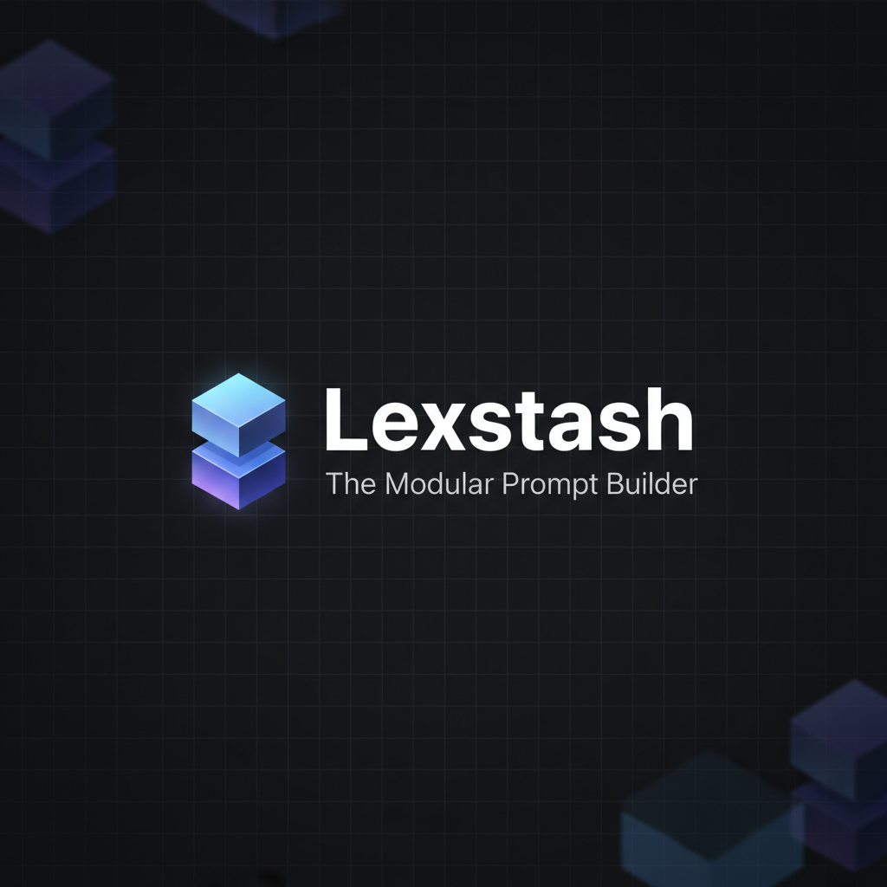

# Lexstash

**Lexstash** is a modular, local‑first visual prompt builder designed for the agentic age. It lets you construct, organize, and compile complex LLM prompts with a drag‑and‑drop interface — and optionally sync a cloud library across devices.

[](https://github.com/benjipeng/lexstash/actions/workflows/deploy.yml)



## ✨ Features

- **Visual Builder**: Drag-and-drop interface to assemble prompts from text blocks, containers, and references.
- **Modular Design**: Create reusable prompt components and reference them in other prompts to avoid repetition.
- **Nested Logic**: Deeply nested containers for complex prompt structures.
- **Variable Support**: Define variables using `{{variable}}` syntax for dynamic prompt generation.
- **Local‑First by Default**: Prompts are stored locally in your browser using IndexedDB (via Dexie.js). Works offline with no server required.
- **Cloud Sync (Optional)**: Sign in with Google to use a Supabase‑backed cloud library. Uploading a prompt also uploads its referenced dependencies (30 prompts max in cloud).
- **Export Options**: Copy your compiled prompts as raw text or cURL commands.
- **Backup / Restore**: Export or import JSON backups of your local library.
- **Customizable UI**: Light/Dark mode plus multiple color themes (Blue, Purple, Green, Orange).
- **Mobile Responsive**: Fully functional on mobile devices with a touch-friendly drawer interface.

## 🛠️ Tech Stack

- **Framework**: [Next.js 16](https://nextjs.org/) (App Router)
- **Styling**: [Tailwind CSS](https://tailwindcss.com/)
- **Local State/Storage**: [Dexie.js](https://dexie.org/) (IndexedDB wrapper)
- **Cloud Sync/Auth (optional)**: [Supabase](https://supabase.com/) (Google OAuth + Postgres)
- **Drag & Drop**: [dnd-kit](https://dndkit.com/)
- **Icons**: [Lucide React](https://lucide.dev/)

## 🚀 Getting Started

### Prerequisites

- Node.js 18+ installed.

### Installation

1.  Clone the repository:
    ```bash
    git clone https://github.com/benjipeng/lexstash.git
    cd lexstash
    ```

2.  Install dependencies:
    ```bash
    npm install
    ```

3.  Run the development server:
    ```bash
    npm run dev
    ```

4.  Open [http://localhost:3000](http://localhost:3000) in your browser.

### Optional: Enable Cloud Sync

Cloud sync is off unless you configure Supabase keys.

1. Copy `.env.template` to `.env.local`.
2. Fill in `NEXT_PUBLIC_SUPABASE_URL` and `NEXT_PUBLIC_SUPABASE_ANON_KEY` from your Supabase project.

## 📖 Usage

1.  **Create a Prompt**: Click the "+" icon in the sidebar or the "New Prompt" button.
2.  **Add Blocks**: Use the toolbar to add **Text**, **Container**, or **Reference** blocks.
3.  **Organize**: Drag and drop blocks to reorder or nest them inside containers.
4.  **Variables**: Insert variables like `{{user_name}}` in your text blocks.
5.  **Preview & Export**: Click the "Preview" (eye icon) button to see the compiled output and copy it to your clipboard.
6.  **Local vs Cloud**: Switch libraries in the sidebar or editor toggle. Prompts save to the active library.
7.  **Upload to Cloud**: When editing a local prompt, click "Upload" to move it (and any referenced prompts) into your cloud library.

## 📄 License

This project is open source and available under the [MIT License](LICENSE).
